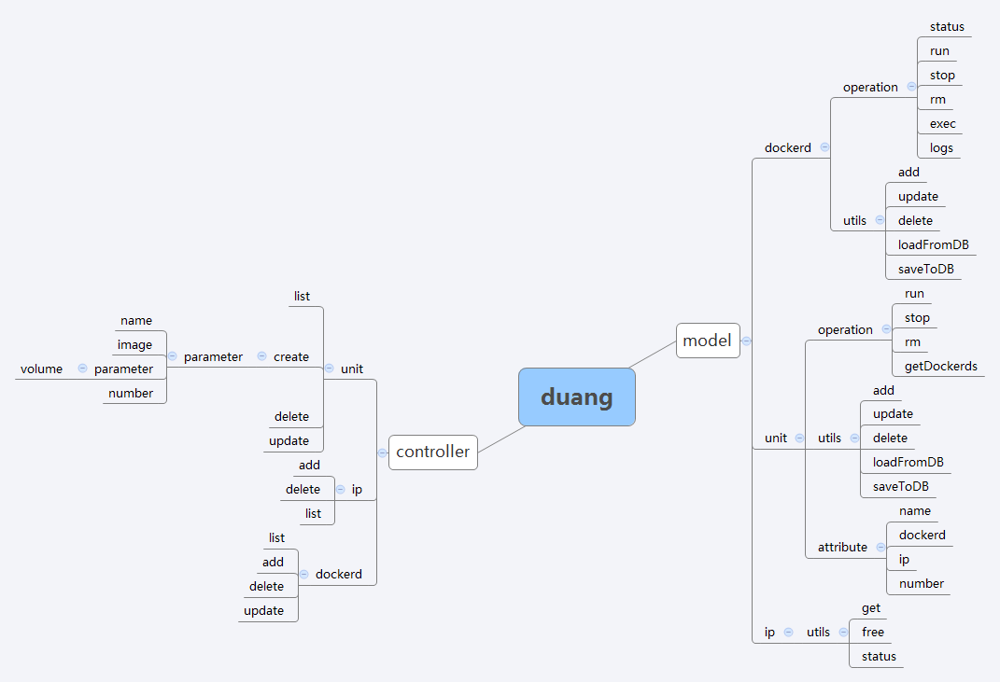

#duang

duang是一个以业务为单位的，分发器+docker集群的方案。前端采用confd+haproxy。

##用法

把代码拉到本地后，在 conf 目录下创建 duang.conf 文件，内容如下

	db_addr = tcp(你的MySQL地址[:端口])
	db_user = MySQL用户名
	db_pass = MySQL密码
	db_name = 数据库名

	db_dropifexist = false #这个仅供测试用。默认不写或者false，如果设置成true，每次启动都会清空数据库。

##架构图

##网络接口描述

###/dockerd

####/dockerd/create

#####方法 GET

创建 dockerd 的前端页面

#####方法 POST

参数

addr=<http|https|unix>://&lt;IP:PORT|socker path&gt;

####/dockerd/list

#####方法 GET

###/unit

####/unit/create

#####方法 GET

创建 Unit 的前端页面

#####方法 POST

参数

json格式

	{
		"name":"centos",
		"image":"centos",
		"number":2,"
		parameteres":[
			{
				"value":"/tmp:/tmp:ro",
				"type":"v"
			},
			{
				"value":"/var/log:/hostlog:ro",
				"type":"v"
			},
			{
				"value":"80:80",
				"type":"v"
			}
		]
	}

####/unit/update/&lt;unit ID&gt;

#####方法 GET

修改 Unit 的前端页面

#####方法 POST

参数

同 /unit/create

####/unit/run/&lt;unit ID&gt;

#####方法 GET

启动 Unit
