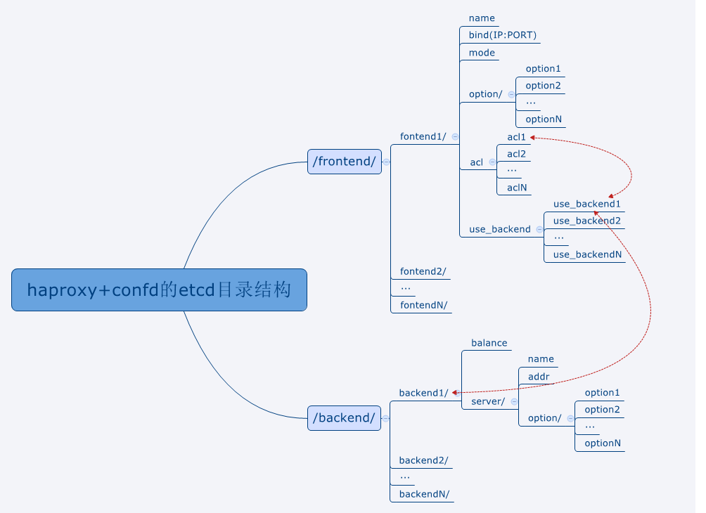

#duang

duang是一个以业务为单位的，分发器+docker集群的方案。前端采用confd+haproxy。

##用法

把代码拉到本地后，在 conf 目录下创建 duang.conf 文件，内容如下

	db_addr = tcp(你的MySQL地址[:端口])
	db_user = MySQL用户名
	db_pass = MySQL密码
	db_name = 数据库名

	db_dropifexist = false #这个仅供测试用。默认不写或者false，如果设置成true，每次启动都会清空数据库。

	etcd_addr = <http|https>://etcd服务器IP:端口
	etcd_root = /根目录

	network_mode = <pipework|nat>

	pipework_path = pipework路径
	pipework_bridge = 网桥

	ssh_user = root
	ssh_prot = 22
	ssh_keypath = ssh私钥

	snmp_version = <2c|1>
	snmp_community = COMMUNITY_NAME
	snmp_timeout = 3
	snmp_retry = 2

##架构图

##网络接口描述

###Struct Description

####UnitStruct

	{
		name:	"nginx:latest",
		number:	2,
		domain:	"www.example.com",
		parameteres:
		[
			{
				value:	"/etc/localtime:/etc/localtime:ro",
				type:	"v",
			},
			{
				value:	"8080:80",
				type:	"d",
			},
		]
	}

####IppoolStruct

	{
		ip:	"192.168.8.100/24@192.168.8.1",
		status:	1,
	}

####DockerdStruct

	{
		addr:	"http://192.168.3.188:2375",
	}

####ContainersStatus

	{
		Dockerd:	
			{
				Id":	1,
				Addr:	"http://192.168.3.147:2375",
			},
		Status:		1
	}

###Interface

* /unit/create

POST UnitStruct

* /unit/ID/update

POST UnitStruct

* /unit/ID/delete

* /unit/ID/run

* /unit/ID/containers

* /unit/ID/status

* /dockerd/ID/update

POST UnitStruct

* /dockerd/ID/delete

* /ippool/ID/release

* /ippool/ID/delete

* /ippool/create

POST IppoolStruct

##和confd配合的etcd目录结构

