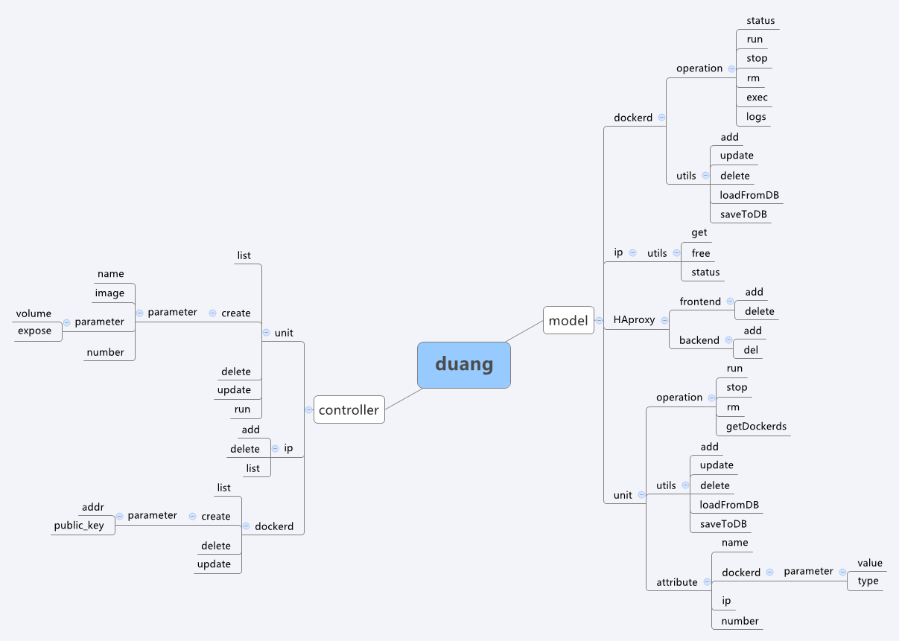

#duang

duang是一个以业务为单位的，分发器+docker集群的方案。前端采用confd+haproxy。

##用法

把代码拉到本地后，在 conf 目录下创建 duang.conf 文件，内容如下

	db_addr = tcp(你的MySQL地址[:端口])
	db_user = MySQL用户名
	db_pass = MySQL密码
	db_name = 数据库名

##架构图

